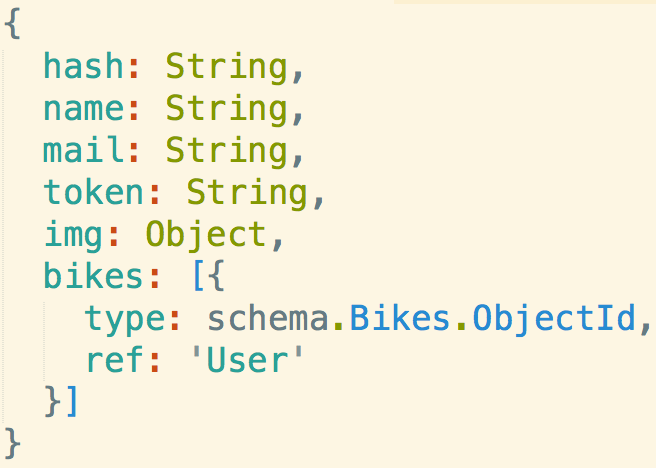
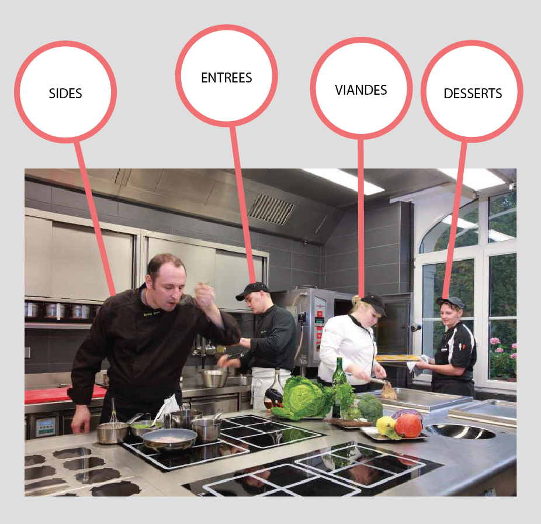
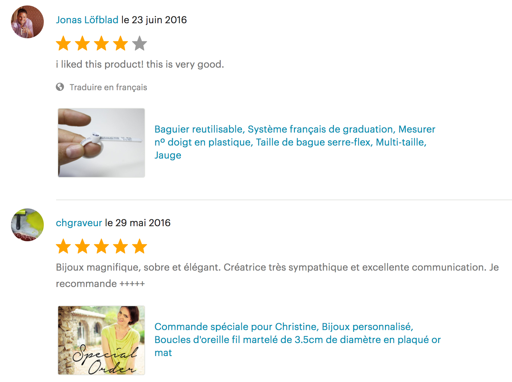

----------------------

# ARCHITECTURE MVC
Découper les différentes étapes d'une architecture MVC avec node et mongo

Ce chapitre s'inscrit dans le module **Node MVC et MongoDB**

1. [ ] [Node MVC MongoDB étape 1](https://github.com/simplonco/node-mvc-sqlite-step1)
    
2. [x] [Node MVC MongoDB étape 2](https://github.com/simplonco/node-mvc-sqlite-step2)
    
3. [ ] [Node MVC MongoDB étape 3](https://github.com/simplonco/node-mvc-sqlite-step3)

Il existe un [module identique avec MongoDB](https://github.com/simplonco/node-mvc-mongodb-step1).

Vous pouvez trouver ce module dans les parcours suivants :

+ Développeur Web Fullstack

------------

### LES MODELS DE LA DATABASE

Dans le cadre de notre exemple cette matière première se trouve dans des champs, fermes, etc...


Mais ce n’est pas le restaurateur qui va les chercher directement,
tout comme notre app ne va pas directement chercher dans les fichier .db.

Il va faire appel à un grossiste qui va les rendre facilement accessibles,
en les indexant, empaquetant, définissant leurs caractéristiques etc...


_(Les failles logiques de cet exemple c’est que c’est aussi le client du restaurant qui va à priori remplir les champs/fermes de produits, et aussi que le restaurateur va voir son grossite à chaque fois qu’on lui commande un plat, mais n’y prêtons pas attention...)_

Notre app va avoir besoin d’une interface similaire.
Il va lui falloir un engin de BDD, pour accéder à la matière première, comme mongoDB ou SQLite3.
C’est aussi grâce à cet engin qu’on va définir sous quel format on veut créer ou récupérer nos données.
Nos models.



Le model c’est par exemple le schema chez mongoose, ou la requête SQL de création de table chez sqlite3.
Et toutes les méthodes annexes qui permettent de protéger ce format.

### LES CONTROLLERS DE L’API

La distinction la plus difficile à faire est celle entre un model et un controller. Les controllers c’est l'équivalent d'une équipe de cuisine. Il y en a un qui est spécialisé sur les plats, l’autre sur les entrées, le dernier sur les desserts.



Les séparer c’est bien pour l’organisation d’abord parce-qu’il ne vont **pas forcément avoir besoin des mêmes outils**. Mais aussi pour éviter la création de bugs quand mon app grossit.
SI jamais un jour je veux rajouter/modifier une nouvelle recette de dessert à mon menu, je n’ai **pas besoin de changer l’espace de travail de toute l’équipe** et je n’ai que le cuistot en charge des desserts à former.

>“Oui mais c’est pas comme ça dans mon app, j’ai un model users, et un controller users.
>En cuisine je vais pas avoir une matière première carotte et un cuistot carotte !”

En effet, mais **les controllers ne sont pas toujours dédiés à un model**. Imaginons dans le cadre d’une marketplace, le model comments suivant :

```
{
    id : String,
    user_id : String,
    shop_id : String,
    text : String,
    title: String,
    stars: Number
}
```

Et un controller comments avec plusieurs methodes. Une des méthode sert à create et n’utilisera à priori que le model comments par exemple.

Maintenant on veut pouvoir cliquer sur un produit et afficher une interface avec tout les commentaires sur la boutique qui le vend.



On va à priori créer une route pour pour pouvoir récupérer toutes ces infos.
Et cette route va nous renvoyer vers une des méthodes de notre controlleur comments en lui envoyant le product en question.

Cette méthode aura besoin :
+ du model _shops_ pour récupérer le shop grace au shop_id de notre product. On pourra ainsi envoyer le nom et la photo de la boutique dans la response.
+ du model _comments_ pour récupérer les commentaires ayant le même shop_id.
+ du model _users_ pour récupérer les noms et photos des users de chaque commentaires.

C’est une recette qui demande **beaucoup** d’ingrédients.

Inversement un controller **auth** qui va gérer toutes nos méthodes de login/token etc...n’a pas de model correspondant.

Un controller peut donc avoir besoin de plusieurs models, avoir un model correspondant, ou pas.

Maintenant qu’on peut intéragir avec notre database on peut directement faire nos **[views](https://github.com/simplonco/node-mvc-mongodb-step3)**.
